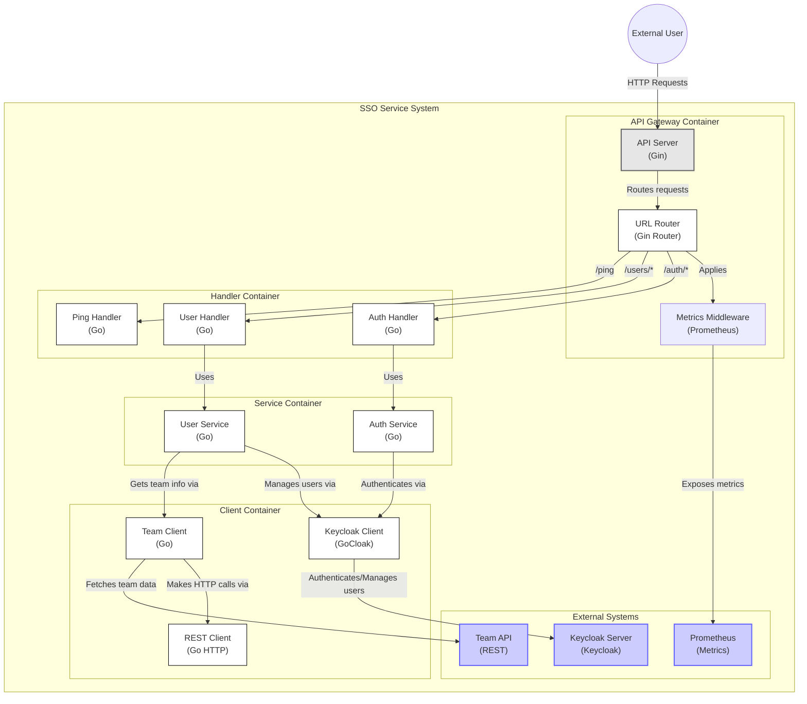

# SSO-SERVICE

It is a 3-tier based architecture with dependency injection.

## Author
  - *Andres Felipe Alfonso Ortiz*

### Technologies
  - *Golang*: programming language.
  - *Gin*: framework for rest applications.
  - *Mokery*: automatic mocks for unit tests.
  - *Dig*: automatic dependency injection.
  - *Docker*: application's contenerization.

### Architecture


### Run unit tests
  ```
    export CONFIG_DIR=$(pwd)/pkg/config && export SCOPE=local && go test -v ./... -covermode=atomic -coverprofile=coverage.out -coverpkg=./... -count=1
  ```
  #### Look result in html
  ```
    go tool cover -html=coverage.out
  ```

**Gin**
  - Documentation
    - https://gin-gonic.com/docs/quickstart/

**Mokery**
  - Documentacion
    - https://vektra.github.io/mockery/latest/
  - Instalacion 
    - mac
    ```
      brew install mockery
    ```
    - windows
    ```
    docker pull vektra/mockery
    ```
  - Crear mocks
    - Mac:
    ```
      mockery --all --disable-version-string
    ```
    - Windows:
    ```
      docker run -v $PWD:/src -w /src vektra/mockery --all
    ```
  - Sort app
    ```
      fieldalignment -fix ./...
    ```
    ```
      gofumpt -l -w .
    ```
  
**Dig**
  - Documentation
    - https://ruslan.rocks/posts/golang-dig
    - https://www.golanglearn.com/golang-tutorials/golang-dig-a-better-way-to-manage-dependency/

**Start Aplication**
  Execute the next command for start/stop the application.
  - API
   ```
    docker-compose up/down 
    docker push furialfonso/sso-service:test
  ```
**Config project**
  - For unit test
  ```
    "go.testEnvVars": {
          "CONFIG_DIR": "${workspaceRoot}/pkg/config",
          "SCOPE":"local"
      },
  ```
  - Environment vs-code
  ```
    "APPLICATION_NAME": "sso-service-local",
    "SCOPE": "local",
    "PORT": "8080",
    "CONFIG_DIR": "${workspaceRoot}/pkg/config",
    "GIN_MODE": "release",
    "KEYCLOAK_SECRET": ""
  ```

**Utils**
- docker-golang
```
https://www.youtube.com/watch?v=Ms5RKs8TNU4&t=1504s
```