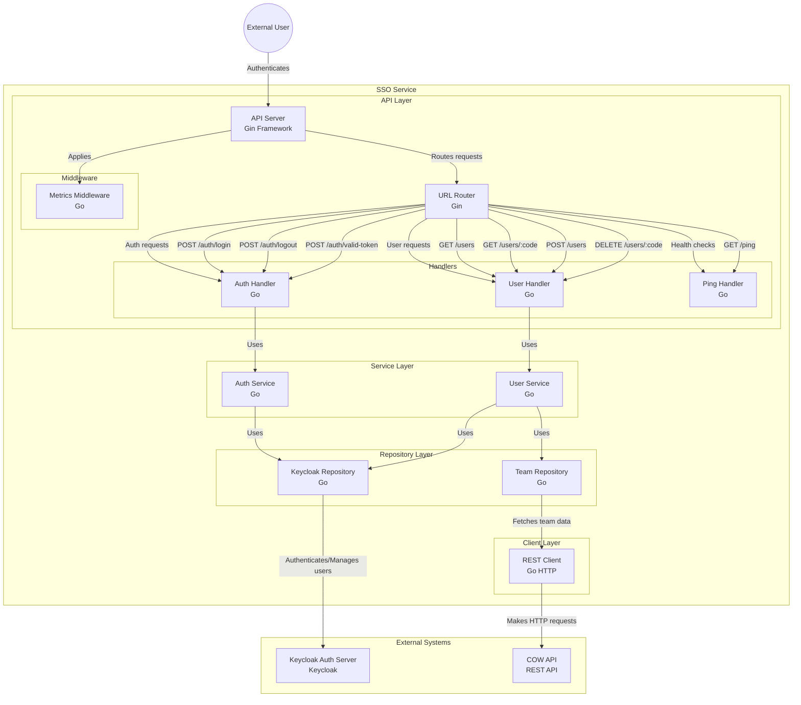

```mermaid
graph TB
    User((External User))
    
    subgraph "SSO Service"
        subgraph "API Layer"
            GinServer["API Server<br>Gin Framework"]
            
            subgraph "Handlers"
                AuthHandler["Auth Handler<br>Go"]
                UserHandler["User Handler<br>Go"]
                PingHandler["Ping Handler<br>Go"]
            end
            
            subgraph "Middleware"
                MetricsMiddleware["Metrics Middleware<br>Go"]
            end
            
            Router["URL Router<br>Gin"]
        end
        
        subgraph "Service Layer"
            AuthService["Auth Service<br>Go"]
            UserService["User Service<br>Go"]
        end
        
        subgraph "Repository Layer"
            KeycloakRepo["Keycloak Repository<br>Go"]
            TeamRepo["Team Repository<br>Go"]
        end
        
        subgraph "Client Layer"
            RestClient["REST Client<br>Go HTTP"]
        end
    end
    
    subgraph "External Systems"
        KeycloakAuth["Keycloak Auth Server<br>Keycloak"]
        CowAPI["COW API<br>REST API"]
    end

    %% User interactions
    User -->|"Authenticates"| GinServer
    
    %% API Layer connections
    GinServer -->|"Routes requests"| Router
    Router -->|"Auth requests"| AuthHandler
    Router -->|"User requests"| UserHandler
    Router -->|"Health checks"| PingHandler
    GinServer -->|"Applies"| MetricsMiddleware
    
    %% Handler to Service connections
    AuthHandler -->|"Uses"| AuthService
    UserHandler -->|"Uses"| UserService
    
    %% Service to Repository connections
    AuthService -->|"Uses"| KeycloakRepo
    UserService -->|"Uses"| KeycloakRepo
    UserService -->|"Uses"| TeamRepo
    
    %% Repository to External Systems connections
    KeycloakRepo -->|"Authenticates/Manages users"| KeycloakAuth
    TeamRepo -->|"Fetches team data"| RestClient
    RestClient -->|"Makes HTTP requests"| CowAPI
    
    %% Main API endpoints
    Router -->|"POST /auth/login"| AuthHandler
    Router -->|"POST /auth/logout"| AuthHandler
    Router -->|"POST /auth/valid-token"| AuthHandler
    Router -->|"GET /users"| UserHandler
    Router -->|"GET /users/:code"| UserHandler
    Router -->|"POST /users"| UserHandler
    Router -->|"DELETE /users/:code"| UserHandler
    Router -->|"GET /ping"| PingHandler
```